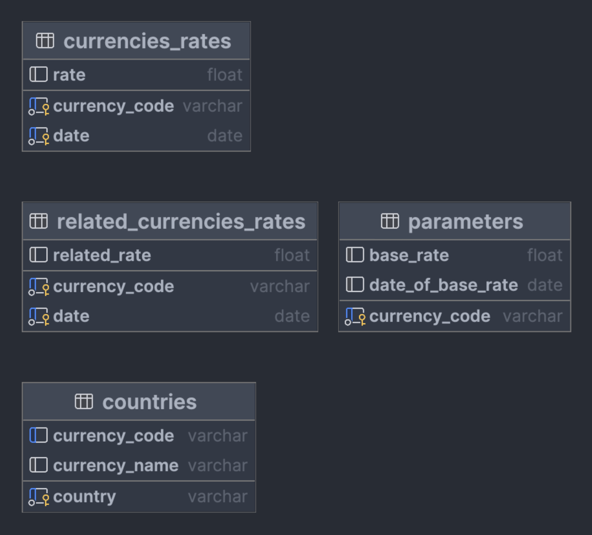

# Веб-приложения для отслеживания курсов валют

Стэк: `Python`, `FastAPI`, `SQLAlchemy`, `SQLite`, `Matplotlib`, `Pandas`

### Функционал

Главная страница

`СКРИН`

Парсинг курсов валют за выбранный промежуток дат.

`СКРИН`

Построение графика относительного изменения курсов валют за выбранный промежуток дат для выбранных стран.

`СКРИН`

Парсинг названий валют (например, рубль) и кода валют (например, RUB) для стран.

`СКРИН`

### Устройство проекта

#### UML

`UML`

#### 4 базы данных

### Установка

Инструкция

### Автор

@todo