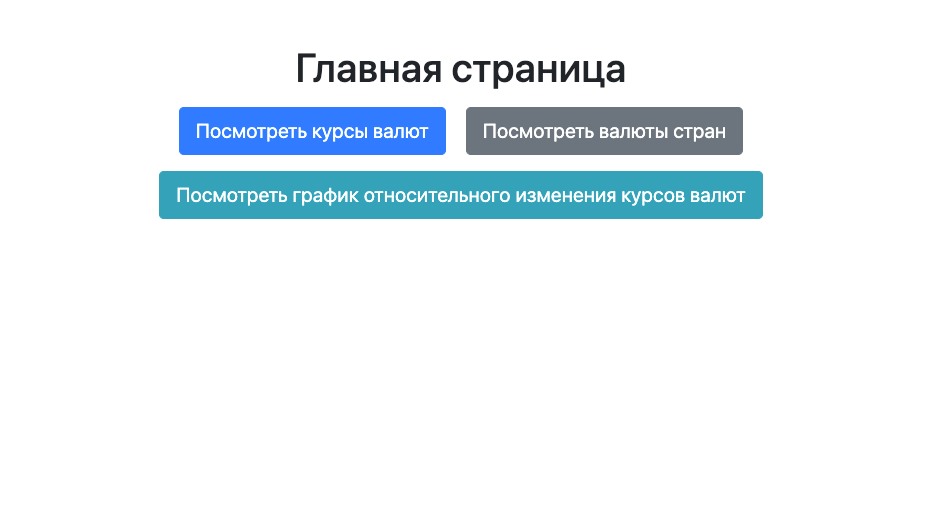
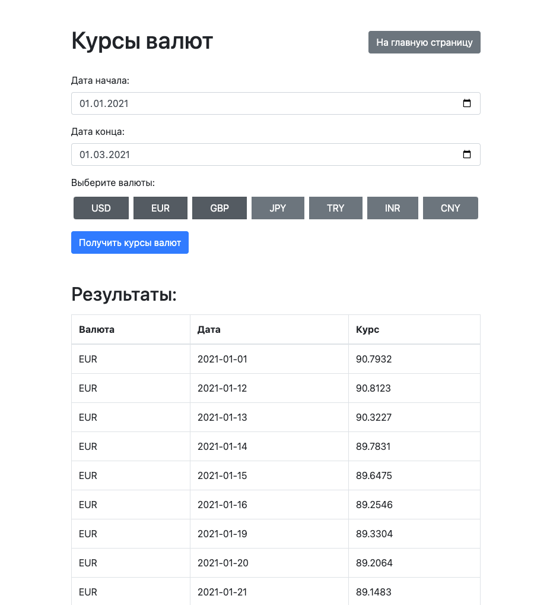
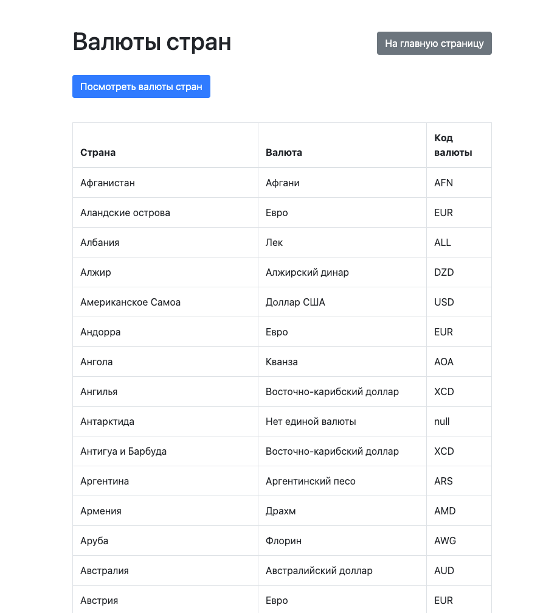
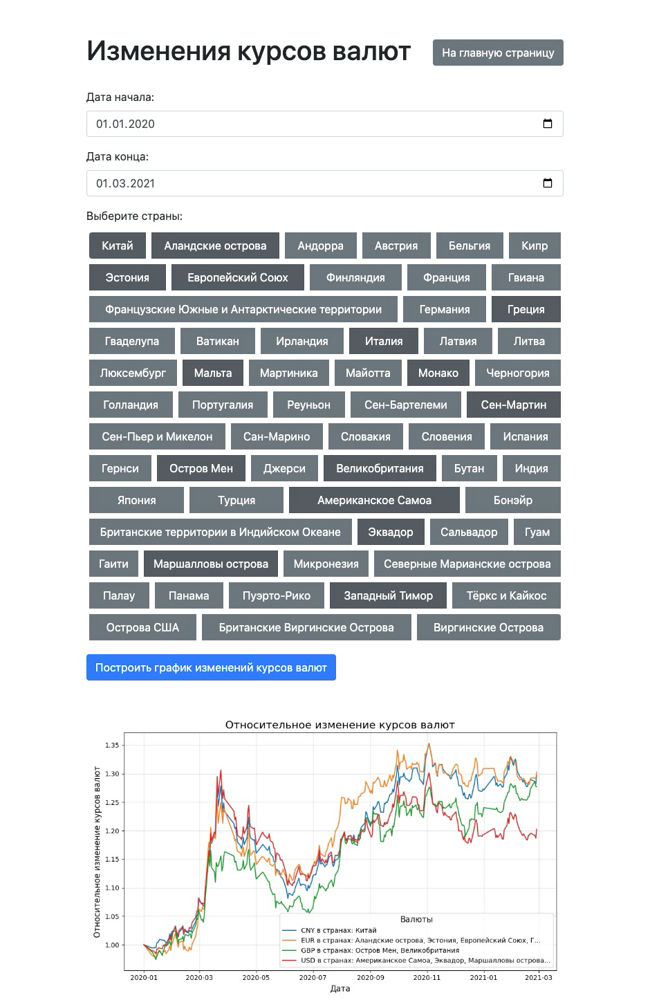
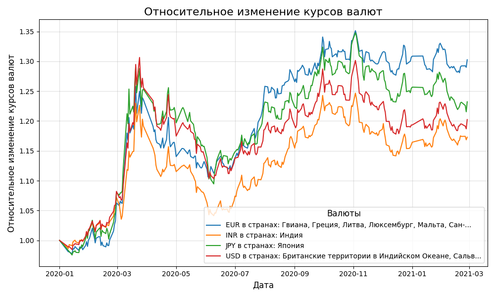
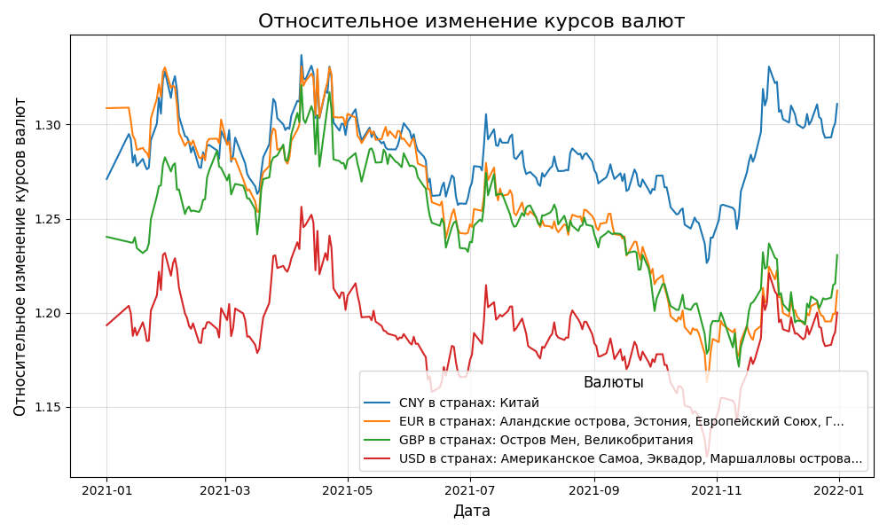

# Веб-приложения для отслеживания курсов валют

Этот проект представляет собой веб-приложение для отображения и управления курсами валют. Приложение предоставляет
интерфейс для получения данных о курсах валют за выбранный период, а также для построения графиков относительных
изменений курсов валют.

Стэк: `Python`, `FastAPI`, `SQLAlchemy`, `Pydantic`, `SQLite`, `Matplotlib`, `Pandas`

#### Используемые технологии

- FastAPI - Веб-фреймворк для создания API
- SQLAlchemy - ORM для работы с базой данных
- Pydantic - Валидация данных
- Jinja2 - Шаблонизатор для HTML
- Bootstrap - CSS фреймворк для стилизации

## Функционал

### Главная страница

На главной странице отображаются три кнопки, которые ведут на другие страницы:

- **Посмотреть курсы валют**
- **Посмотреть валюты стран**
- **Посмотреть график относительного изменения курсов валют**



### Страница "Посмотреть курсы валют"

На этой странице пользователь может выбрать диапазон дат и выбрать одну или несколько валют.

После выбора нажимается кнопка для получения курсов валют, и данные отображаются на экране.



### Страница "Посмотреть график относительного изменения курсов валют"

На этой странице пользователь может выбрать диапазон дат и выбрать страны для построения графика относительного
изменения курсов валют.



### Страница "Посмотреть валюты стран"

На этой странице отображается информация о странах и связанных с ними валютах.



Страница генерирует графики относительного изменения валют.

 



[//]: # (## Устройство проекта)

[//]: # ()
[//]: # (### UML)

[//]: # ()
[//]: # (`UML`)

[//]: # ()
[//]: # (### 4 базы данных)

[//]: # ()
[//]: # (![ER.png]&#40;docs/ER.png&#41;)

[//]: # ()
[//]: # (### Структура проекта)

[//]: # ()
[//]: # (```plaintext)

[//]: # (currency-app/)

[//]: # (│)

[//]: # (├── api.py                     # Определение API маршрутов)

[//]: # (├── controllers/)

[//]: # (│   ├── base_controller.py     # Базовый контроллер CRUD операций)

[//]: # (│   ├── country_controller.py  # Контроллер для стран и валют)

[//]: # (│   └── currency_controller.py # Контроллер для курсов валют)

[//]: # (├── database.py                # Настройка базы данных)

[//]: # (├── init_db.py                 # Скрипт для инициализации базы данных)

[//]: # (├── main.py                    # Главный файл для запуска приложения)

[//]: # (├── models.py                  # Определение моделей базы данных)

[//]: # (├── parser.py                  # Парсеры для получения данных о курсах валют и валютах стран)

[//]: # (├── schemas.py                 # Определение Pydantic схем)

[//]: # (├── static/)

[//]: # (│   └── style.css              # Статические файлы &#40;CSS&#41;)

[//]: # (├── templates/)

[//]: # (│   ├── base.html              # Базовый HTML шаблон)

[//]: # (│   ├── currency_rates.html    # Шаблон страницы курсов валют)

[//]: # (│   ├── country_currencies.html # Шаблон страницы валют стран)

[//]: # (│   └── relative_rates.html    # Шаблон страницы относительных курсов)

[//]: # (├── requirements.txt           # Список зависимостей)

[//]: # (└── README.md                  # Документация проекта)

[//]: # (```)

## Установка и запуск

### Установка через виртуальное окружение

1. Клонируйте репозиторий:
   ```bash
   git clone https://github.com/kudrmax/exchange-rate-synchronizer/
   cd exchange-rate-synchronizer
   ```

2. Создайте и активируйте виртуальное окружение:
   ```bash
   python -m venv venv
   source venv/bin/activate  # для Windows: venv\Scripts\activate
   ```

3. Установите зависимости:
   ```bash
   pip install -r requirements.txt
   ```

5. Запустите приложение:
   ```bash
    python app/main.py  # python3 для UNIX-систем
   ```

6. Откройте браузер и перейдите по адресу [http://0.0.0.0:8000](http://0.0.0.0:8000).

### Установка через Poetry

1. Клонируйте репозиторий:
   ```bash
   git clone https://github.com/kudrmax/exchange-rate-synchronizer/
   cd exchange-rate-synchronizer
   ```

2. Установите Poetry, если он не установлен

3. Создайте виртуальное окружение и установите зависимости:
   ```bash
   poetry install
   ```

4. Активируйте виртуальное окружение:

   ```bash
   poetry shell
   ```

6. Запустите приложение:
   ```bash
   python app/main.py  # python3 для UNIX-систем
   ```

7. Откройте браузер и перейдите по адресу [http://0.0.0.0:8000](http://0.0.0.0:8000).

### Автор

@todo
